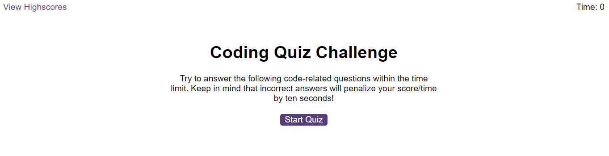

# Code Quiz

This application is a webpage that contains a quiz on JavaScript. The user will initiate the quiz and the timer will begin. A series of questions will be displayed until they are answered or the countdown is reached. The result is based on two factors: correct answers and time taken. The user can save their score in the leaderboard which is saved in Local Storage.

## Built With

* JavaScript
* HTML/CSS

## Pages

### Front Page

Click the start button to begin the quiz.

### Front Page

Answer the questions before the timer runs out.

### Front Page

When the quiz ends, enter initials and submit to leaderboard